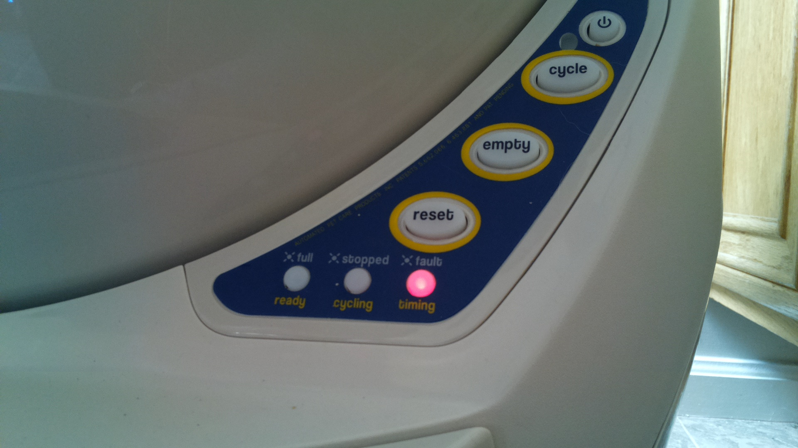

# DeepCat
CNN Based status detector for the Litter Robot III. 

Basicaly I have a litter robot which is shoved into a far corner of the house which only Mr. Cat frequents. So much to the cat's disgust, it ends up blinking blue (which signifies full litter bin) for many days without nobody noticing. The idea was to build something that can detect blinking blue (amongst other) lights. 

## Cool so whats the 'NN' part?
I understand that there are atleast 2 much easier ways of solving this problem:
- I could have opened the litter robot control panel and tapped into the LEDs and fed them to a photon/raspberry pi. That would be too easy
- I could have mounted a raspberry pi with a camera pointed in a known way and then used openCV to look for the blue/red/yellow or the absence thereof.

OR

I can use a Neural net to do all of this. I just really wanted to use a CNN in a home project, basically.

In the end I have a classifier uses a fine-tuned SqueezeNet that does _fairly_ well on images of varying brightness and registers ~ 100% test accuracy on images taken from different cameras *if* I stay within some defined boundaries (particular range of distance away, all 3 lights showing in the picture, etc). In here I discuss what I tried and what went wrong.

PLEASE feel free to email me if you have a suggestion on how I can improve this or if Im doing something completely wrong. I'm a noob when it comes to neural nets.

## Data Collection
This was by far the hardest part. I figured out quite a bit (I think!) on how to collect data and what to use as training data. What I have available as train_data_orig.tar I collected by recording a video from various angles and distances, using my phone camera and then the raspberry pi camera. I moved the cameras around to generate offsets in the image as a method to increasing the number of data points. Images like the following were generated:

| Red | Yellow | Blue | None |
|---|---|---|---|
|||||

### Problems faced
- I quickly realized that lighting had a big role to play so if I trained my classifier in daylight it would perform poorly at night when my yellow warm LED lighting would come on. So I decided to feed it in some data with the yellow light shining as well to help it generalize. I tried using equalize_adapthist to fix the lightning situation but couldn't find any easy way to completely remove it from the picture. If anyone knows how to, please let me know!
